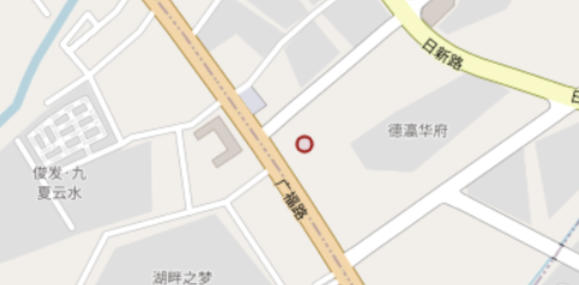
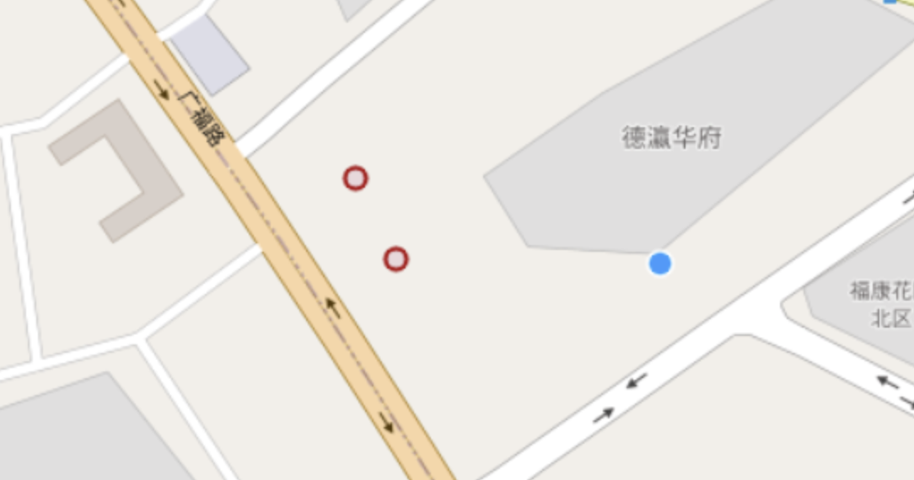
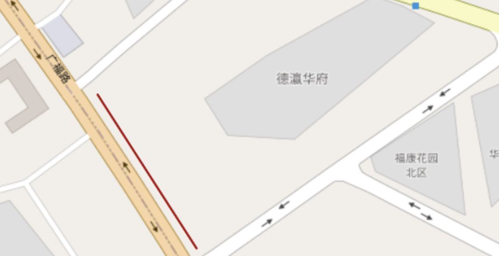
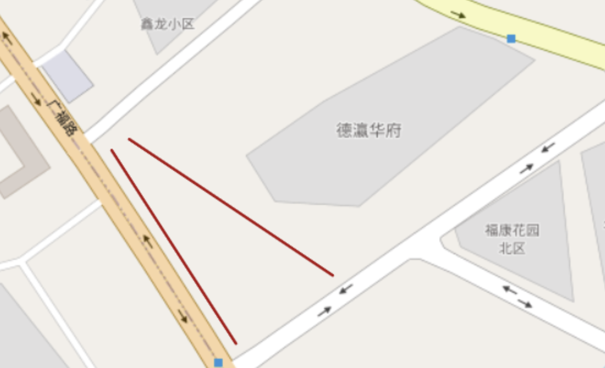
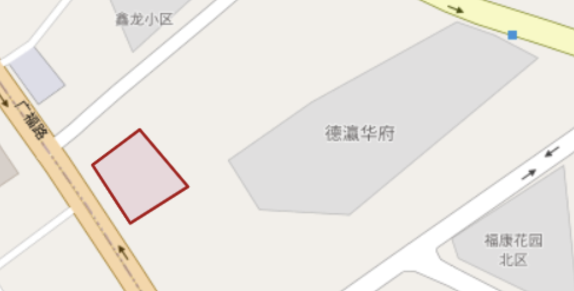

# JTS学习笔记

## 简介

JTS由加拿大的VividSolutions公司开发，是一个用Java语言描述的几何拓扑套件，遵循OpenGIS的Simple Feature Specification，封装了2D几何类型和非常多的空间分析操作，而且包含了不少常见的计算几何算法实现。
JTS被广泛地应用在开源GIS软件中，作为GeoTools和基于GeoTools的GeoServer和uDig的底层库。

**Maven依赖**

```
<dependency>
   <groupId>com.vividsolutions</groupId>
   <artifactId>jts</artifactId>
   <version>1.13</version>
</dependency>
```

## 几何模型

### Point 点



``` java
Coordinate coord = new Coordinate(102.6806945800781 24.999259605696068);
Point point = new GeometryFactory().createPoint( coord );
```

或

``` java
WKTReader reader = new WKTReader(new GeometryFactory());
Point point = (Point)reader.read("POINT(102.6806945800781 24.999259605696068)");
```

### MultiPoint 多点



``` java
WKTReader reader = new WKTReader(new GeometryFactory());
MultiPoint mpoint = (MultiPoint)reader.read("MULTIPOINT((102.6806945800781 24.999259605696068),(102.6811065673828 24.99851282550918))");
```

### LineString 线



``` java
Coordinate[] coords  = new Coordinate[]{new Coordinate(102.67990493826801, 24.999349063221004), new Coordinate(102.68184471235142, 24.9966108454865)};
LineString line = new GeometryFactory().createLineString(coords);
```

或

``` java
WKTReader reader = new WKTReader(new GeometryFactory());
LineString line = (LineString)reader.read("LINESTRING(102.67990493826801 24.999349063221004,102.68184471235142 24.9966108454865)");
```

### MultiLineString 多线



``` java
GeometryFactory geometryFactory = new GeometryFactory();
Coordinate[] coords1  = new Coordinate[] {new Coordinate(102.67990493826801, 24.999349063221004), new Coordinate(102.68184471235142, 24.9966108454865)};
LineString line1 = geometryFactory.createLineString(coords1);
Coordinate[] coords2  = new Coordinate[] {new Coordinate(102.68017959647113, 24.999504642938945), new Coordinate(102.68335533194477,24.997575452644412)};
LineString line2 = geometryFactory.createLineString(coords2);
LineString[] lineStrings = new LineString[2];
lineStrings[0]= line1;
lineStrings[1] = line2;
MultiLineString ms = geometryFactory.createMultiLineString(lineStrings);
```

或

``` java
WKTReader reader = new WKTReader(new GeometryFactory());
MultiLineString line = (MultiLineString)reader.read("MULTILINESTRING((102.67990493826801 24.999349063221004,102.68184471235142 24.9966108454865),(102.68017959647113 24.999504642938945,102.68335533194477 24.997575452644412))");
```

### Polygon 面



``` java
WKTReader reader = new WKTReader(new GeometryFactory());
Polygon polygon = (Polygon)reader.read("POLYGON((102.68002510070801 24.99920904358541,102.68057441790008 24.99844670247988,102.68141555759941 24.99892900051202,102.68071174621583 24.999675779831406,102.68002510070801 24.99920904358541))");
```

### MultiPolygon 多面

``` java
WKTReader reader = new WKTReader(new GeometryFactory());
MultiPolygon mpolygon = (MultiPolygon) reader.read("MULTIPOLYGON(((40 10, 30 0, 40 10, 30 20, 40 10),(30 10, 30 0, 40 10, 30 20, 30 10)))");
```


