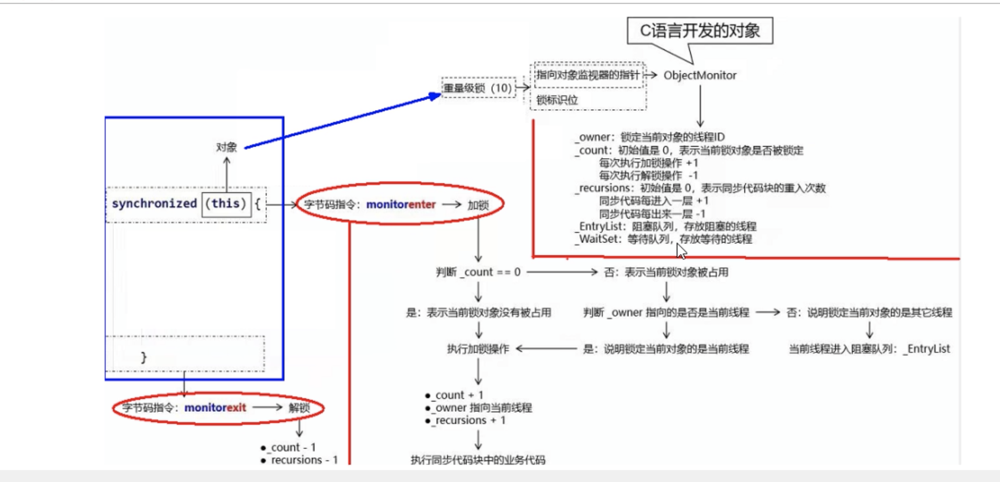
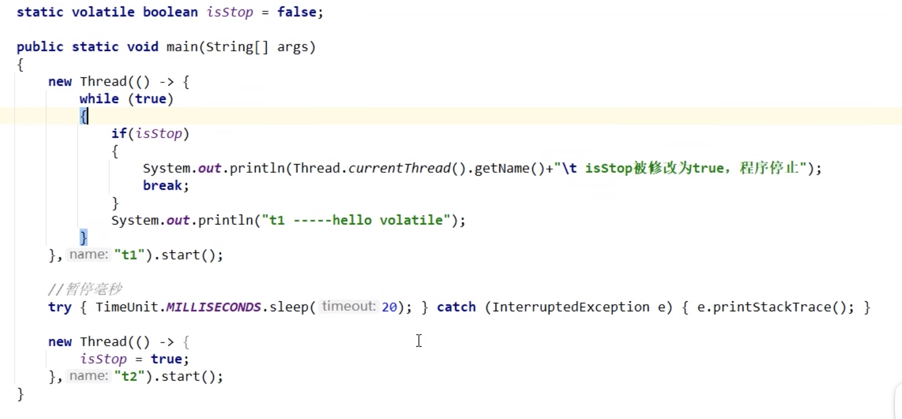
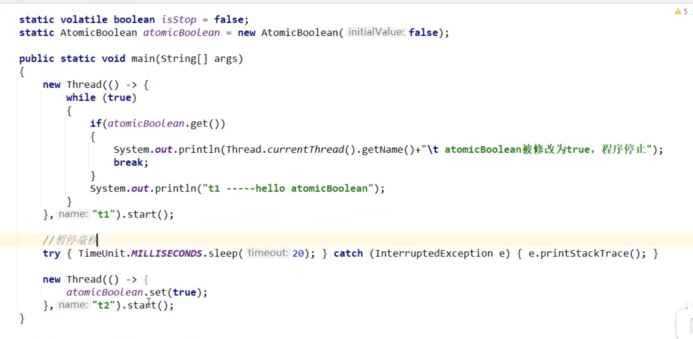
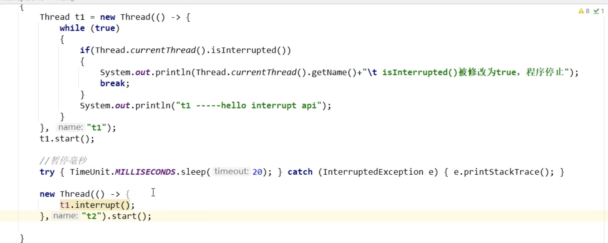
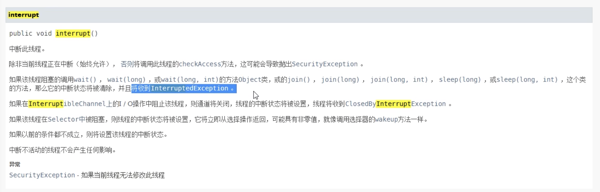
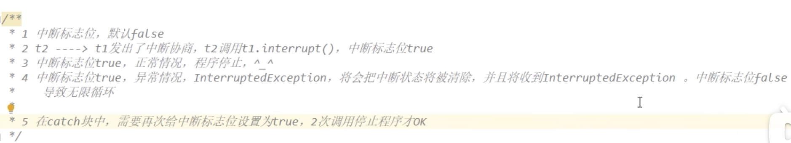

# JUC并发编程

## 一把锁、2个并、3个程

* 一把锁

  s

* 2个并

  * 并发：两个任务，统一处理器交替执行
  * 并行：两个任务同时处理

* 3个程

  * 进程：一个应用程序就是一个进程
  * 线程：一个进程下有多个线程
  * 管程：Monitor（监视器），也就是常说的锁，JVM中同步是基于进入和退出监视器对象来实现的，每个对象实例都会有一个Monitor对象

#### 用户现场与守护线程

一般情况下不做特别说明，默认都是用户线程

* 用户线程：是系统的工作线程，完成这个程序需要完成的业务操作
* 守护线程：特殊的线程，为其他线程服务的，默默的执行系统行的服务，服务线程，用户线程结束，虚拟机会自动退出守护线程

判断是用户线程还是守护线程

``` java
public final boolean isDaemon(){
  return daemon;
}
```

true：守护线程

false：用户线程

## CompletableFuture的引出

#### Future为什么出现

Future(FutureTask实现类)接口定义了一步任务执行的一些方法，获取执行结果，取消任务，判断任务是否被取消，判断任务执行是否完毕

Future是java5提供的接口，提供了一步并行计算的功能

主线程执行一个很耗时的计算任务，我们就可以把这个任务放到一步线程中，主线程继续执行其他任务，在通过Future获取计算结果

Runnable接口没有返回值

Callable接口有返回值

Future接口和FutureTask实现类

需要实现：多线程/有返回/异步

FutureTask+线程池的缺点：

1. get()阻塞： 容易导致阻塞，一般建议放在程序后面，一旦调用必须获得结果才执行下一步	

   加入不想等待太长时间，希望过时不侯，自动离开，get可以加入超时时间，过时抛异常，，我们就可以捕获异常做相应的处理

2. isDone()轮训：轮训会损耗无谓的cpu资源

get容易导致阻塞，我们可以判断future的状态，什么时候完成了什么时候调用，就不会容易导致阻塞，实际工作不建议直接用get，非常容易阻塞

futureTask.isDone()判断任务是否完成

对于简单的业务场景使用Future完全OK

回调通知：主动通知

创建异步任务：Future+线程池配合

多个任务前后依赖可以组合处理：

​		后一个异步任务，依赖于前一个异步任务的值

​		两个或多个异步任务计算合并成一个异步计算

对计算速度选最快


阻塞的方式和异步编程的设计理念相违背，而轮训的方式会耗费无谓的CPU资源。因此

## CompletableFuture

引入了CompletableFuture

CompletableFuture提供了一种观察者模式类似的机制，可以让任务执行完成后通知监听的一方

CompletableFuture实现了Future和CompletionStage

CompletionStage 代表异步计算过程中的某一个阶段，一个阶段完成以后可能会触发另一个阶段

### 核心的四个静态方法

* runAsync无 返回值
  * public static CompletableFuture<Void> runAsync(Runable runable)
  * public static CompletableFuture<Void> runAsync(Runable runable,Executor executor)
* supplyAsync 有 返回值
  * public static<U> CompletableFuture<U> supplyAsync(Supplier<U> supplier)
  * public static<U> CompletableFuture<U> supplyAsync(Supplier<U> supplier,Executor executor)

Executor executor说明：如果没有指定默认使用ForkJoinPool.commonPool()作为它的线程池

案例：

``` java
public class CompleableFutureBuildDemo {
    public static void main(String[] args) throws ExecutionException, InterruptedException {
        ExecutorService executorService = Executors.newFixedThreadPool(3);
        // CompletableFuture<Void> voidCompletableFuture = CompletableFuture.runAsync(() -> {
        //     System.out.println(Thread.currentThread().getName());
        //     try {
        //         TimeUnit.SECONDS.sleep(1);
        //     } catch (InterruptedException e) {
        //         e.printStackTrace();
        //     }
        // },executorService);
        // System.out.println(voidCompletableFuture.get());

        CompletableFuture<String> objectCompletableFuture = CompletableFuture.supplyAsync(()->{
                System.out.println(Thread.currentThread().getName());
                try {
                    TimeUnit.SECONDS.sleep(1);
                } catch (InterruptedException e) {
                    e.printStackTrace();
                }
                return "hello";
        });
        System.out.println(objectCompletableFuture.get());
        executorService.shutdown();
    }
}

```

通用功能和平常注意事项

```
whenComplete((v,e)->{}) 处理上一个任务的返回值
exceptionally(e->{}) 处理上个任务的异常
```

主线程不要立即结束，否则compleableFuture默认使用的线程池会立即关闭，通常使用自定义线程池避免这个问题

CompleableFuture的优点：

1. 异步任务结束时，会自动回调某个对象的方法
2. 主线程设置好回调后，不再关心异步任务的执行，异步任务之间可以顺序执行
3. 异步任务出错时，会自动回调某个对象的方法


函数式接口：

* Runable   无参数，无返回值
* Function(功能型函数式接口)  有一个输入参数，有一个返回参数
* Consume(消费型函数式接口) 有一个输入参数，没有返回值
  * BiConsumer 有两个输入参数，没有返回值
* Supplier(供给型函数式接口)没有输入参数，有一个返回值

| 函数式接口名称 | 方法名称 | 参数 | 返回值 |
| -------------- | -------- | ---- | ------ |
| Runable        | run      | 0    | 0      |
| Function       | apply    | 1    | 1      |
| Consume        | accept   | 1    | 0      |
| BiConsumer     | accept   | 2    | 0      |
| supplier       | get      | 0    | 1      |

链式调用

``` java
@Accessors(chain=true) // 开启链式调用
```

join和get的区别就是抛不抛异常的问题


### CompleableFuture常用方法

1. 获得结果和触发计算

   1. 获得结果

      ``` java
      // 后去结果需要抛异常
      public T get()
      ```

      ``` java
      public T get(long timeout,TimeUnit unit)
      ```

      ``` java
      // 获取结果不用抛异常
      public T join()
      ```

      ``` java
      // 如果计算完则获得结果，否则返回valueIfAbsent
      public T getNow(T valueIfAbsent) 
      ```

   2. 主动触发计算

      ``` java
      // 是否打断并立即获得括号中的值
      // 计算完成时，返回false，后面用join获取值就是计算后的值
      // 计算未完成时，返回true，后面获取值时就是括号中设置的值
      public boolean complete(T value) 
      ```

2. 对计算结果

   1. thenApply
      1. 计算结果存在依赖关系，这两个线程串行化
      2. 由于存在依赖管理（当前步骤错，不走下一步），当前步骤有异常的话就叫停
   2. handle
      1. 计算结果存在依赖关系，这两个线程串行化
      2. 有异常也可以往下一步走，根据带的异常参数可以进行下一步的处理

3. 对计算结果进行消费

   1. thenAccept:接收任务的处理结果，并消费处理，**无返回结果** 

   2. 代码之前的顺序执行问题

      1. thenRun
         * thenRun(Runable runable) 任务A执行完执行B，并且B不需要A的结果
      2. thenAccept
         * thenAccept(Consumer action) 任务A执行完执行B，B需要A的结果，但是任务B**无返回值**
      3. thenApply
         * thenApply(Function fn) 任务A执行完执行B，B需要A的结果，同时任务B是**有返回值的**

   3. CompleableFuture和线程池说明

      * 没有传入自定义线程池，都用默认线程池ForkJoinPool
      * 传入了一个自定义线程池
        * 如果是thenRun 就使用前一个的线程池
        * 如果是thenRunAsync，就不会使用前一个的线程池，会使用默认的ForkJoinPool
      * 有可能处理太快，系统优化切换原则，直接使用main线程处理

   4. 对计算速度进行选用

      1. 谁快用谁

      2. applyToEither

         ``` java
         // 那个先计算出结果，就返回那个的compleableFuture对象
         cpC = cpA.applyToEither(cpB,f->{return f+ "is winer"})
         ```

   5. 对计算结果进行合并

      1. 连个CompletionStage任务都完成后，最终能把两个任务的结果一起交给thenCombine来处理

      2. 先完成的先等着，等待其他分支任务

      3. thenCombine

         ``` java
         cp<T> result = cpA.thenCombine(cpB,(x,y)->{return x+y});
         ```

         

## 多线程锁之线程锁知识概念

锁的类别：

1. 乐观锁和悲观锁
2. 公平锁和非公平锁
3. 可重入锁
4. 死锁及排查
5. 自旋锁
6. 轻量锁，偏向锁，邮戳锁

### 乐观锁和悲观锁

#### 悲观锁

认为自己在使用数据的时候一定有别的线程来修改数据，因此在获取数据的时候会先加锁，确保数据不会被别的线程修改

适合写操作多的场景，先加锁可以保证写操作时数据正确

显式的锁定之后再操作同步资源

synchronized关键字和Lock的实现类都是悲观锁

#### 乐观锁

认为自己在使用数据的时候不会有别的线程修改数据或资源，所以不会添加锁

在java中时通过使用无锁编程来实现的，知识在更新数据的时候去判断，之前有没有别的线程更新了这个数据

如果这个数据没有被更新，当前线程将自己修改的数据成功写入

如果这个数据已经被其他线程更新，则更具不同的实现方式执行不同的操作，比如放弃修改，重试抢锁等等。

判断规则：

1. 版本号机制Version
2. 最常采用的是CAS算法（Compare-and-swap,比较并替换），Java原子类中的递增操作就通过CAS自旋实现的

适合赌操作多的场景，不加锁的特点能够使其他读操作的性能大幅提升

乐观锁则直接去操作同步资源，是一种无锁算法，得之我幸不得我命，在努力就是

-------

### 8锁案例

1. 标准访问有ab两个线程，请问先打印邮件还是短信
2. sendEmail方法中加入暂停3秒，请问先打印邮件还是短信
3. 添加一个普通的hello方法，请问先打印邮件还是hello
4. 有两部手机，请问先打印邮件还是短信
5. 有两个静态同步方法，有1部手机，请问先打印邮件还是短信
6. 有两个静态同步方法，有2部手机，请问先打印邮件还是短信
7. 有一个静态同步方法，有一个普通同步方法，有1部手机，请问先打印邮件还是短信
8. 有一个静态同步方法，有一个普通同步方法，有2部手机，请问先打印邮件还是短信


详细说明：

* 第一种情况：

因为syncronized是悲观锁，所以同一时刻只能有一个线程可以进入该资源类，所有先打印邮件，再打印短信

一个资源类里面，假如有100个syncronized方法，只要其中一个被访问了，我锁的不是那一个方法，锁的是syncronized方法所在的整个资源类

* 第二种情况：

同第一种情况，先打印邮件，后打印短信

**总结第一和第二种情况：**

一个对象里面如果有多个syncronized方法，某一个时刻内，值要一个线程前调用其中的一个syncronized方法了

其他线程都只能等待，换句话说，某一个时刻内，只能有唯一的一个线程前访问这写syncronized方法

锁的是当前对象this，被锁后，其他的线程都不能进入到当前对象的其他syncronized方法

**总结第三种和第四种情况：**

加个普通方法后发现和同步锁无关

缓存两个对象后，不是同一把锁，情况立刻变化

**总结第五种和第六种情况：**

 三种synchronized锁的内容有一些差别：

对于普通同步方法，锁的是当前实例对象，通常指this，具体的异步手机，所有的普通同步方法用的都是同一把锁->实例对象本身，

对于静态同步方法，锁的是当前类的Class对象，如iphone.class唯一的一个模板

对于同步方法块，锁的是synchronized括号内的对象

**总结第七种和第八种情况：**

当一个线程试图访问同步代码时它首先必须得到锁，正常退出或抛出异常时必须释放锁

所有的普通同步方法用的都是同一把锁--实例对象本身，这就是new出来的具体实例对象本身，本类this

也就是说如果一个实例对象的普通同步方法获取锁后，该实例对象的其他普通同步方法必须等待获取锁的方法释放锁后才能获取锁

所有的静态同步方法用的也是同一把锁---类对象本身，就是我们说过的唯一模板Class

具体实例对象this和唯一模板Class这两把锁锁两个不同的对象，所以静态同步方法与普通同步方法之间时不会有竞态条件的，但是一旦一个静态同步方法获取锁后，其他的静态同步方法都必须等待该方法释放锁后才能获得锁

synchronized体现的3个地方

* 对象锁：作用与实例方法，当前实例加锁，进入同步代码前要获得当前实例的锁
* 作用与代码块，对括号里的配置对象加锁
* 类锁：作用与静态方法，当前类加锁，进去同步代码前要获得当前类对象的锁

文件反编译：

``` java
javap - c *.class
```

* -c对代码进行反编译

* 假如需要更多信息

  ``` java
  javap -v *.class
  ```

  *  -v -verbose 输出附加信息

synchronized同步代码块

``` java
monitorenter  // synchronized加锁开始
  
monitorexit // synchronized正常释放
monitorexit // 如果程序出错也要释放锁
```

一般情况一个enter两个exit

synchronized方法

``` java
ACC_SYNCHRONIZED // 开始加锁
```

synchronized静态方法

``` java
ACC_STATIC,ACC_SYNCHRONIZED
```

什么事管程Monitor，就是锁，也成为监视器，是一种程序结构，结构内的多个子程序（对象或模块）形成多个工作线程互斥访问共享资源

为什么任何一个对象都可以成为一个锁

因为在底层创建对象时，每个对象天生都带着一个对象监视器

每一个被锁住的对象都会和Monitor关联起来

### 公平锁与非公平锁

java共同抢夺同一份资源时避免乱序和挤压保证数据的一致性和安全性都要先持有锁各个线程获取锁的几率是不一样的

``` java
ReentrantLock log = new ReentrantLock(); // 默认非公平锁，ReentrantLock(true)公平锁
public void sale(){
  lock.lock();
  try{
    if(number >0){
      sout("test")
    }finally{
      lock.unlock();
    }
  }
}
```

* 公平锁（ReentrantLock(true)）：先来先得 
* 非公平锁（ReentrantLock(false)），后来的也可能先获得锁

面试题：为什么会有公平锁/非公平锁的设计？为什么默认非公平锁

1. 恢复挂起的线程到真正锁的获取还是有时间差的，从开发人员来看这个时间微乎其微，但是从cpu的角度来看，这个时间差存在的还是很明显。所以非公平锁能更充分的利用CPU的时间片，尽量减少CPU的空闲状态时间

2. 使用多线程很重要的考量点事线程切换的开销，当采用非公平锁时，当一个线程请求锁获得同步状态，然后释放同步状态，所以刚释放锁的线程在此刻再次获取同步状态的概率就变得非常大，所以就减少了线程大开销

### 可重入锁

可重入锁又称为递归锁是指在同一个线程在外层方法获取锁的时候，再进入该线程的内层方法会自动获取锁（前提，锁对象得是同一个），不会因为之前已经获取过还没释放而阻塞

就是一个synchronized方法，拥有一把锁，方法里面还有synchronized代码块也是同一把锁，那么进入里面锁的时候，不会释放外面的

直接可以获取自己的内部锁

一个线程中的多个流程可以获得同一把锁，持有这把同步锁可以再次进入

可重入锁的种类

* 隐式锁：及synchronized关键字使用的锁，默认是可重入锁
  * 指可以重复递归调用的锁，在外层使用锁之后，在内层仍然可以使用，并且不会发生死锁，这样的锁就叫可重入锁
  * 一个synchronized修饰的方法或代码块的内部调用本类的前提synchronized修饰的方式或代码块时，是永远可以得到锁
* Synchronized的重入的实现机理
  * 为什么任何一个对象都可以成为一个锁
    * 每个锁对象拥有一个锁计数器和一个指向持有该锁的线程的指针
      * 当执行monitorenter时，如果目标锁对象的计数器为零，那么说明它没有被其他线程所持有，java虚拟机会将改对象的持有线程设置为当前线程，并且将其计数器加1
      * 在目标所对象的计数器不为0的情况下，如果锁对象的持有线程，那么java虚拟机可以将其计数器加1，否则需要等待，直至持有线程释放该锁
      * 当执行monitoreexit时java虚拟机则需要将锁对象的计数器-1，计数器为0代表锁已被释放
* 显式锁：及Lock，也有ReentrantLock这样的可重入锁 
  * lock和unlock要一一匹配
  * 要注意上面的+1和-1

### 死锁案例和排查命令

死锁：两个及以上的线程因争抢资源而造成互相等待的现象

产生死锁的主要原因：

1. 系统资源不足
2. 进程运行推进的顺序不合适
3. 资源分配不当 

写死锁：A锁操作B锁，B锁操作A锁

如何排查死锁：

* 第一种：
  * Jsp -l /java p s -ef ：查出进程编号
  * jstack 进程编号
* 第二种：
  * jconsole 
    * 连接查询
    * 点击线程
    * 检查死锁

会显示 deadlock

### 多线程锁之ObjectMonitor和syncronized小结

* 8锁案例
  * 对象锁
  * 类锁
* 公平锁和非公平锁
* 可重入锁（递归锁）
* 死锁及排查
* 为什么任何一个对象都可以成为一个锁
  * objectMonitor.hpp



## LogckSupport与线程中断

 #### 线程中断机制

``` java
void interrupt(); // 中断此线程
static boolean interrupted(); // 测试当前线程是否已被中断
boolean isInterrupted(); // 测试此线程是否已被中断
```

问题：

1. 如何中断一个运行中的线程
2. 如何停止一个运行中的线程

介绍：

一个线程不应该由其他线程来强制中断或停止，而是应该由线程自己自行停止。

在java中没有办法立即停止一条线程，然后停止线程却显得尤其重要，如取消一个耗时操作

因此java提供了一种用于停止线程的协商机制--中断，也即中断标识协商机制

中断只是一种协作协商机制，java没有给中断增加任何语法，中断的过程完全需要程序员自己实现

若要中断一个线程，你需要手动调用该线程的interrupt方法，该方法也仅仅是将线程对象的中断标识设成true

接下来需要自己写代码不断的检测当前线程的标识位，如果为true，表示别的线程请求这条线程中断，此时究竟该做什么需要自己写代码实现

每个线程对象中都有一个中断标识位，用于表示线程是否被中断，该标识位为true表示中断，为false表示未中断

通过调用线程对象的interrupt方法将线程的标识位设置为true，可以在别的线程中调用，也可以在自己的线程中调用

1. interrupt() ：中断状态改为true

``` java
/**
* 实例方法：just to set the interrupt flag
* 实例方法interrupt()仅仅是设置线程的中断状态为true,发起一个协商而不会立即停止线程
*/
public void interrupt();
```

2. interrupted():返回中断状态，并清除中断状态

``` java
/**
* 静态方法：Thread.interrupted();
* 判断线程是否被中断并清除当前中断的状态
* 这个方法做两件事
* 1. 返回当前线程的中断状态，测试当前线程是否已被中断
* 2. 将当前线程的中断状态清零并重新设为false，清除线程的中断状态
*/
public static boolean interrupted();
```

3. isInterrupted(): 判断当前线程是否被中断（通过检查中断标志位）

``` java
// 实例方法
// 含义：判断当前线程是否被中断（通过检查中断标志位）
public boolean isInterrupted();
```

如何停止中断运行中的线程？

1. 通过一个volatile变量实现

   

2. 通过AutomicBoolean

   

3. 同过Thread类自带的中断Api实例方法实现

   在需要中断的线程中不断监听中断状态

   一旦发生中断，就执行相应的中断处理业务逻辑stop线程

   



interrupt底层调用的是interrupt0这个方法

当调用interrupt()时

1. 如果线程处于正常活动状态，那么会将该线程的中断标志设置为true，被设置中断标志的线程将继续正常运行，不受影响，所以，interrupt()并不能真正的中断线程，需要被调用的线程自己进行配合才行
2. 如果线程处于被阻塞状态（例如：sleep,wait,join等状态),在别的线程中调用当前对象的interrupt方法那么线程将立即退出被阻塞状态，并抛出一个InterruptedException异常

**当前线程的中断标识为true，是不是线程立刻停止**

不会立即停止，需要自己手动代码实现

以及执行完的线程（不活动的线程）interrupt不会产生任何影响


如果线程处于被阻塞状态（例如：sleep,wait,join等状态),在别的线程中调用当前对象的interrupt方法那么线程将立即退出被阻塞状态，并抛出一个InterruptedException异常，此时必须做异常处理，并且再调用一次interrupt()否则会死循环





**静态方法Thread.interrupted()的理解**

``` java
/**
* 静态方法：Thread.interrupted();
* 判断线程是否被中断并清除当前中断的状态
* 这个方法做两件事
* 1. 返回当前线程的中断状态，测试当前线程是否已被中断
* 2. 将当前线程的中断状态清零并重新设为false，清除线程的中断状态
*/
public static boolean interrupted();
```

Thread.interrupted()// 静态方法

Thread.currentThread().isInterrupted()// 实例方法

这两者底层调用的是同一个方法，区别就是是否需要重置状态

