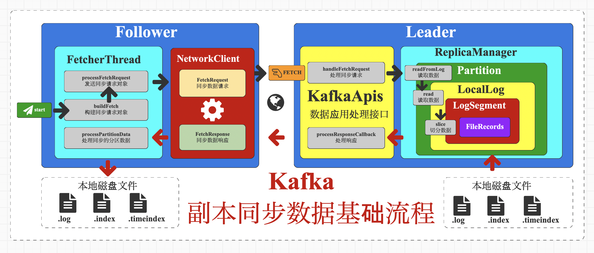

### Kafka学习笔记

#### 第一章：基础知识

Producer：消息生产者，就是向Kafka broker 发消息的客户端。

Consumer：消息消费者，向Kafka broker 取消息的客户端。

Consumer Group（CG）：消费者组，由多个consumer组成。消费者组内每个消费者负责消费不同分区的数据，一个分区只能由一个组内消费者消费；消费者组之间互不影响。所有的消费者都属于某个消费者组，即消费者组是逻辑上的一个订阅者。

Broker：一台Kafka服务器就是一个broker。一个集群由多个broker组成。一个broker可以容纳多个topic。

Topic： 可以理解为一个队列，生产者和消费者面向的都是一个topic。

Partition： 为了实现扩展性，一个非常大的topic可以分布到多个broker（即服务器）上，一个topic可以分为多个partition，每个partition是一个有序的队列。

Replica：副本。一个topic的每个分区都有若干个副本，一个Leader和若干个Follower。

Leader：每个分区多个副本的 “主”，生产者发送数据的对象，以及消费者消费数据的对象都是Leader。

Follower：每个分区多个副本中的 “从”，实时从 Leader 中同步数据，保持和 Leader 数据的同步。Leader 发生故障时，某个Follower会成为新的 Leader。

#### 第二章：主题创建

主题相关 kafka-topics.sh

1. 创建topic

``` bash
kafka-topics.sh --create --topic test --bootstrap-server localhost:9092
```

参数含义：

* --create创建的意思
* --topic 指定topic的意思后面加上topic名称
* --bootstrap-server 指定连接那个kafka，**必须传参**

注意：

* 控制台有很多日志是jdk版本问题，需要11以上的版本不会出现日志问题

2. 查看topic

查看topic列表

``` bash
kafka-topics.sh --bootstrap-server localhost:9092 --list
```

查看topic详情

``` bash
kafka-topics.sh --bootstrap-server localhost:9092 --topic test  --describe
```

3. 修改topic

``` bash
kafka-topics.sh --bootstrap-server localhost:9092 --topic test --alter --partitions 2
```

参数含义：

* --alter 修改的意思

4. 删除topic

``` bash
kafka-topics.sh --bootstrap-server localhost:9092 --topic test --delete
```

注意：

* 删除topic时，如果是windows安装的kafka，会异常中断，linux不会

#### 第三章：生产者

| 参数名                                | 参数作用                                                     | 类型 | 默认值     | 推荐值                                      |
| ------------------------------------- | ------------------------------------------------------------ | ---- | ---------- | ------------------------------------------- |
| bootstrap.servers                     | 集群地址，格式为：brokerIP1:端口号,brokerIP2:端口号          | 必须 |            |                                             |
| key.serializer                        | 对生产数据Key进行序列化的类完整名称                          | 必须 |            | Kafka提供的字符串序列化类：StringSerializer |
| value.serializer                      | 对生产数据Value进行序列化的类完整名称                        | 必须 |            | Kafka提供的字符串序列化类：StringSerializer |
| interceptor.classes                   | 拦截器类名，多个用逗号隔开                                   | 可选 |            |                                             |
| batch.size                            | 数据批次字节大小。此大小会和数据最大估计值进行比较，取大值。估值=61+21+（keySize+1+valueSize+1+1） | 可选 | 16K        |                                             |
| retries                               | 重试次数                                                     | 可选 | 整型最大值 | 0或整型最大值                               |
| request.timeout.ms                    | 请求超时时间                                                 | 可选 | 30s        |                                             |
| linger.ms                             | 数据批次在缓冲区中停留时间                                   | 可选 |            |                                             |
| acks                                  | 请求应答类型：all(-1), 0, 1                                  | 可选 | all(-1)    | 根据数据场景进行设置                        |
| retry.backoff.ms                      | 两次重试之间的时间间隔                                       | 可选 | 100ms      |                                             |
| buffer.memory                         | 数据收集器缓冲区内存大小                                     | 可选 | 32M        | 64M                                         |
| max.in.flight.requests.per.connection | 每个节点连接的最大同时处理请求的数量                         | 可选 | 5          | 小于等于5                                   |
| enable.idempotence                    | 幂等性，                                                     | 可选 | true       | 根据数据场景进行设置                        |
| partitioner.ignore.keys               | 是否放弃使用数据key选择分区                                  | 可选 | false      |                                             |
| partitioner.class                     | 分区器类名                                                   | 可选 | null       |                                             |

##### 生产者流程


##### 拦截器和序列化

###### 增加拦截器类

1.  实现生产者拦截器接口ProducerInterceptor

*  实现接口中的方法，根据业务功能重写具体的方法

| ***\*方法名\****  | ***\*作用\****                                               |
| ----------------- | ------------------------------------------------------------ |
| onSend            | 数据发送前，会执行此方法，进行数据发送前的预处理             |
| onAcknowledgement | 数据发送后，获取应答时，会执行此方法                         |
| close             | 生产者关闭时，会执行此方法，完成一些资源回收和释放的操作     |
| configure         | 创建生产者对象的时候，会执行此方法，可以根据场景对生产者对象的配置进行统一修改或转换。 |

* 配置自定义的拦截器

ProducerConfig.INTERCEPTOR_CLASSES_CONFIG, KafkaInterceptorMock.class.getName()

##### 回调方法

``` java
// TODO 发送数据
producer.send(record, new Callback() {
   // TODO 回调对象
   public void onCompletion(RecordMetadata recordMetadata, Exception e) {
      // TODO 当数据发送成功后，会回调此方法
      System.out.println("数据发送成功：" + recordMetadata.timestamp());
  }
});
```

默认是异步发送

同步发送：代码实现上，采用的是JDK1.5增加的JUC并发编程的Future接口的get方法实现

``` java
// TODO 发送数据
producer.send(record, new Callback() {
   // TODO 回调对象
   public void onCompletion(RecordMetadata recordMetadata, Exception e) {
      // TODO 当数据发送成功后，会回调此方法
      System.out.println("数据发送成功：" + recordMetadata.timestamp());
  }
}).get();
```

##### 消息分区

增加分区器

* 实现Kafka提供的分区类接口Partitioner

* 我们只关注partition方法即可，因为此方法的返回结果就是需要的分区编号

* 配置分区器 ProducerConfig.PARTITIONER_CLASS_CONFIG, KafkaPartitionerMock.class.getName()

##### 消息可靠性

ACK应答

0：代表producer往集群发送数据不需要等到集群的返回，不确保消息发送成功。安全性最低但是效 率最高。
1：代表producer往集群发送数据只要leader应答就可以发送下一条，只确保leader发送成功。
all：代表producer往集群发送数据需要所有的follower都完成从leader的同步才会发送下一条，确保 leader发送成功和所有的副本都完成备份。安全性最⾼高，但是效率最低。

##### 重复与乱序问题

kafka因为数据重试引发了重复与乱序问题，解决这个办法kafka引入了幂等性操作

##### 幂等性

默认幂等性是不起作用的，所以如果想要使用幂等性操作，只需要在生产者对象的配置中开启幂等性配置即可

ProducerConfig.ENABLE_IDEMPOTENCE_CONFIG, true

| 配置项                                | 配置值    | 说明                                             |
| ------------------------------------- | --------- | ------------------------------------------------ |
| enable.idempotence                    | true      | 开启幂等性                                       |
| max.in.flight.requests.per.connection | 小于等于5 | 每个连接的在途请求数，不能大于5，取值范围为[1,5] |
| acks                                  | all(-1)   | 确认应答，固定值，不能修改                       |
| retries                               | >0        | 重试次数，推荐使用Int最大值                      |

##### 数据事务

``` java
 // TODO 启动事务

 producer.beginTransaction();

// TODO 终止事务

producer.abortTransaction();
```


#### 第四章：数据存储




##### 存储组件

**Ø** ***\*KafkaApis\**** : Kafka应用接口组件，当Kafka Producer向Kafka Broker发送数据请求后，Kafka Broker接收请求，会使用Apis组件进行请求类型的判断，然后选择相应的方法进行处理。

**Ø** ***\*ReplicaManager\**** : 副本管理器组件，用于提供主题副本的相关功能，在数据的存储前进行ACK校验和事务检查，并提供数据请求的响应处理

**Ø** ***\*Partition\**** : 分区对象，主要包含分区状态变换的监控，分区上下线的处理等功能，在数据存储是主要用于对分区副本数量的相关校验，并提供追加数据的功能

**Ø** ***\*UnifiedLog\**** : 同一日志管理组件，用于管理数据日志文件的新增，删除等功能，并提供数据日志文件偏移量的相关处理。

**Ø** ***\*LocalLog\**** : 本地日志组件，管理整个分区副本的数据日志文件。假设当前主题分区中有3个日志文件，那么3个文件都会在组件中进行管理和操作。

**Ø** ***\*LogSegment\**** : 文件段组件，对应具体的某一个数据日志文件，假设当前主题分区中有3个日志文件，那么3个文件每一个都会对应一个LogSegment组件，并打开文件的数据管道FileChannel。数据存储时，就是采用组件中的FileChannel实现日志数据的追加

**Ø** ***\*LogConfig\****: 日志配置对象，常用的数据存储配置

日志配置参数

| ***\*参数名\****            | ***\*参数作用\****         | ***\*类型\**** | ***\*默认值\****                 | ***\*推荐值\**** |
| --------------------------- | -------------------------- | -------------- | -------------------------------- | ---------------- |
| min.insync.replicas         | 最小同步副本数量           | 推荐           | 1                                | 2                |
| log.segment.bytes           | 文件段字节数据大小限制     | 可选           | 1G = 1024*1024*1024 byte         |                  |
| log.roll.hours              | 文件段强制滚动时间阈值     | 可选           | 7天 =24 * 7 * 60 * 60 * 1000L ms |                  |
| log.flush.interval.messages | 满足刷写日志文件的数据条数 | 可选           | Long.MaxValue                    | 不推荐           |
| log.flush.interval.ms       | 满足刷写日志文件的时间周期 | 可选           | Long.MaxValue                    | 不推荐           |
| log.index.interval.bytes    | 刷写索引文件的字节数       | 可选           | 4 * 1024                         |                  |
| replica.lag.time.max.ms     | 副本延迟同步时间           | 可选           | 30s                              |                  |

##### 数据存储

###### ACKS校验

暂未记录

##### 文件存储格式

###### 数据日志文件

暂未记录

###### 数据索引文件

暂未记录

###### 数据时间索引文件

某些场景中，我们不想根据顺序（偏移量）获取Kafka的数据，而是想根据时间来获取的数据。这个时候，可没有对应的偏移量来定位数据，那么查找的效率就非常低了，因为kafka还提供了时间索引文件，咱们来看看它的内容是什么

通过时间戳就可以找到偏移量，再通过偏移量找到定位信息，再通过定位信息找到数据不就非常方便了吗。

######  查看文件内容

如果我们想要查看文件的内容，直接看是看不了，需要采用特殊的之类

**执行查看文件的指令**

``` bash
kafka-run-class.bat kafka.tools.DumpLogSegments --files ../../data/kafka/test-0/00000000000000000000.log --print-data-log
```

##### 数据刷写

在Linux系统中，当我们把数据写入文件系统之后，其实数据在操作系统的PageCache（页缓冲）里面，并没有刷到磁盘上。如果操作系统挂了，数据就丢失了。一方面，应用程序可以调用fsync这个系统调用来强制刷盘，另一方面，操作系统有后台线程，定时刷盘。频繁调用fsync会影响性能，需要在性能和可靠性之间进行权衡。实际上，Kafka提供了参数进行数据的刷写

Ø log.flush.interval.messages ：达到消息数量时，会将数据flush到日志文件中。

Ø log.flush.interval.ms ：间隔多少时间(ms)，执行一次强制的flush操作。

Ø flush.scheduler.interval.ms：所有日志刷新到磁盘的频率

log.flush.interval.messages和log.flush.interval.ms无论哪个达到，都会flush。官方不建议通过上述的三个参数来强制写盘，数据的可靠性应该通过replica来保证，而强制flush数据到磁盘会对整体性能产生影响。

##### 副本同步

Kafka中，分区的某个副本会被指定为 Leader，负责响应客户端的读写请求。分区中的其他副本自动成为 Follower，主动拉取（同步）Leader 副本中的数据，写入自己本地日志，确保所有副本上的数据是一致的。

###### 启动数据同步线程

Kafka创建主题时，会根据副本分配策略向指定的Broker节点发出请求，将不同的副本节点设定为Leader或Follower。一旦某一个Broker节点设定为Follower节点，那么Follower节点会启动数据同步线程ReplicaFetcherThread，从Leader副本节点同步数据。

线程运行后，会不断重复两个操作：截断（truncate）和抓取（fetch）。

Ø 截断：为了保证分区副本的数据一致性，当分区存在Leader Epoch值时，会将副本的本地日志截断到Leader Epoch对应的最新位移处.如果分区不存在对应的 Leader Epoch 记录，那么依然使用原来的高水位机制，将日志调整到高水位值处。

Ø 抓取：向Leader同步最新的数据。

###### 生成数据同步请求

启动线程后，需要周期地向Leader节点发送FETCH请求，用于从Leader获取数据。

等待Leader节点的响应的过程中，会阻塞当前同步数据线程。

###### 处理响应数据

当Leader副本返回响应数据时，其中会包含多个分区数据，当前副本会遍历每一个分区，将分区数据写入数据文件中。

##### 更新数据偏移量

跟新数据偏移量

###### Offset

Kafka的每个分区的数据都是有序的，所谓的数据偏移量，指的就是Kafka在保存数据时，用于快速定位数据的标识，类似于Java中数组的索引，从0开始。

###### LSO

起始偏移量（Log Start Offset），每个分区副本都有起始偏移量，用于表示副本数据的起始偏移位置，初始值为0。

LSO一般情况下是无需更新的，但是如果数据过期，或用户手动删除数据时，Leader的Log Start Offset可能发生变化，Follower副本的日志需要和Leader保持严格的一致，因此，如果Leader的该值发生变化，Follower自然也要发生变化保持一致。

###### LEO

日志末端位移（Log End Offset），表示下一条待写入消息的offset，每个分区副本都会记录自己的LEO。对于Follower副本而言，它能读取到Leader副本 LEO 值以下的所有消息。

###### HW

高水位值（High Watermark），定义了消息可见性，标识了一个特定的消息偏移量（offset），消费者只能拉取到这个水位offset之前的消息，同时这个偏移量还可以帮助Kafka完成副本数据同步操作。

##### 数据一致性

为了提升数据的一致性，Kafka引入了高水位（HW ：High Watermark）机制，Kafka在不同的副本之间维护了一个水位线的机制（其实也是一个偏移量的概念），消费者只能读取到水位线以下的的数据。**这就是所谓的木桶理论：木桶中容纳水的高度，只能是水桶中最短的那块木板的高度**。这里将整个分区看成一个木桶，其中的数据看成水，而每一个副本就是木桶上的一块木板，那么这个分区（木桶）可以被消费者消费的数据（容纳的水）其实就是数据最少的那个副本的最后数据位置（木板高度）。

也就是说，消费者一开始在消费Leader的时候，虽然Leader副本中已经有a、b、c、d 4条数据，但是由于高水位线的限制，所以也只能消费到a、b这两条数据。

###### ISR伸缩

ISR（In-Sync Replicas）

在Kafka中，一个Topic（主题）包含多个Partition（分区），Topic是逻辑概念，而Partition是物理分组。一个Partition包含多个Replica（副本），副本有两种类型Leader Replica/Follower Replica，Replica之间是一个Leader副本对应多个Follower副本。注意：分区数可以大于节点数，但副本数不能大于节点数。因为副本需要分布在不同的节点上，才能达到备份的目的。

Kafka的分区副本中只有Leader副本具有数据写入的功能，而Follower副本需要不断向Leader发出申请，进行数据的同步。这里所有同步的副本会形成一个列表，我们称之为同步副本列表（**In-Sync Replicas**），也可以简称***\*ISR\****，除了***\*ISR\****以外，还有已分配的副本列表（***\*Assigned Replicas\****），简称***\*AR。\****这里的AR其实不仅仅包含ISR，还包含了没有同步的副本列表（***\*Out-of-Sync Replicas\****），简称***\*OSR\****

生产者Producer生产数据时，ACKS应答机制如果设置为all（-1），那此时就需要保证同步副本列表ISR中的所有副本全部接收完毕后，Kafka才会进行确认应答。

数据存储时，只有ISR中的所有副本LEO数据都更新了，才有可能推高HW偏移量的值。这就可以看出，ISR在Kafka集群的管理中是非常重要的。


#### 第五章： 消费数据

消费流程


基本步骤:

1. 创建配置对象
   * 服务器地址
   * key序列化
   * value序列化
   * 消费者组ID
2. 创建消费者对象 KafkaConsumer
3. 订阅主题 subscribe
4. 从Kafka的主题中获取数据
5. 关闭消费者对象

##### 基本配置

| 参数名                        | 参数作用                                                     | 类型 | 默认值           | 推荐值                                        |
| ----------------------------- | ------------------------------------------------------------ | ---- | ---------------- | --------------------------------------------- |
| bootstrap.servers             | 集群地址，格式为：brokerIP1:端口号,brokerIP2:端口号          | 必须 |                  |                                               |
| key.deserializer              | 对数据Key进行反序列化的类完整名称                            | 必须 |                  | Kafka提供的字符串反序列化类：StringSerializer |
| value.deserializer            | 对数据Value进行反序列化的类完整名称                          | 必须 |                  | Kafka提供的字符串反序列化类：ValueSerializer  |
| group.id                      | 消费者组ID，用于标识完整的消费场景，一个组中可以包含多个不同的消费者对象。 | 必须 |                  |                                               |
| auto.offset.reset             |                                                              |      |                  |                                               |
| group.instance.id             | 消费者实例ID，如果指定，那么在消费者组中使用此ID作为memberId前缀 | 可选 |                  |                                               |
| partition.assignment.strategy | 分区分配策略                                                 | 可选 |                  |                                               |
| enable.auto.commit            | 启用偏移量自动提交                                           | 可选 | true             |                                               |
| auto.commit.interval.ms       | 自动提交周期                                                 | 可选 | 5000ms           |                                               |
| fetch.max.bytes               | 消费者获取服务器端一批消息最大的字节数。如果服务器端一批次的数据大于该值（50m）仍然可以拉取回来这批数据，因此，这不是一个绝对最大值。一批次的大小受message.max.bytes （broker config）or max.message.bytes （topic config）影响 | 可选 | 52428800（50 m） |                                               |
| offsets.topic.num.partitions  | 偏移量消费主题分区数                                         | 可选 | 50               |                                               |

获取数据：

Kafka会根据消费者发送的参数，返回数据对象ConsumerRecord。返回的数据对象中包括指定的数据。

| 数据项    | 数据含义   |
| --------- | ---------- |
| topic     | 主题名称   |
| partition | 分区号     |
| offset    | 偏移量     |
| timestamp | 数据时间戳 |
| key       | 数据key    |
| value     | 数据value  |

##### 偏移量offset

###### 起始偏移量

kafka默认设置为LEO,需要修改服务启动后开始从什么地方读取数据需要配置：auto.offset.reset

1. earliest：从最早的数据开始读
2. latest：从最晚的数据开始读
3. none：

###### 指定偏移量消费

如果要自定义偏移量区域，则需要先获取集群信息然后代码去实现


kafka默认会每个5秒把消费者id消费的当前偏移量进行保存，避免机器宕机导致重启不知道该从什么位置开始读取数据

如果要修改需要改：auto.commit.interval.ms 不过这个方案并不好，其实kafka还提供了手动提交方案

###### 偏移量提交

1. 自动提交

kafka默认就是自动提交，默认5秒提交一次

2. 手动提交

首先配置ENABLE_AUTO_COMMIT_CONFIG:false 先关闭自动提交

* 消费者对象.commitAsync() 异步提交
* 消费者对象.commitSync()同步提交

更多情况选用异步提交

 上面的自动提交或手动提交是为了避免重复消费数据或漏消费数据，不过这两种方法依然不能很好解决这两个问题。

* 自动提交的问题：

数据重复：在消费数据时还未来得及提交偏移量，消费者就重启了，此时就会从上一个偏移量开始消费就出现了重复

* 手动提交问题：

漏消费：我们把偏移量提交了，但我们数据还没来得及处理，消费者重启了，重启的消费者就会从最新数据开始处理，就漏消费了

如果要解决重复消费与漏消费，就必须将拉取数据后的业务处理和偏移量绑定在一起，但kafka并不提供这种事务处理，所以就需要第三方，这个就没有过多介绍

##### 消费者组基本介绍

一个topic不能被多个消费者消费

一个用户可以消费多个topic

如果有两个topic，三个用户，那么最后一个用户则不能获取到数据，只起到备用作用

当有用户宕机，切换到备用用户时，备用用户如何知道之前到用户消费到哪里了？

在kafka的处理是将偏移量存放到zookeeper，但是有一个问题就是会导致消费者频繁的去更新zookeeper节点数据

所以0.90版本之前，这个信息是记录在zookeeper内的，在0.90之后的版本，offset保存在**__consumer_offsets**这个内部topic内

##### 消费者分配策略介绍

消费者中的每个消费者到底消费哪一个主题分区，这个分配策略其实是由消费者的Leader决定的，这个Leader我们称之为群主。群主是多个消费者中，第一个加入组中的消费者，其他消费者我们称之为Follower，称呼上有点类似与分区的Leader和Follower。

消费者加入群组的时候，会发送一个JoinGroup请求。群主负责给每一个消费者分配分区。

每个消费者只知道自己的分配信息，只有群主知道群组内所有消费者的分配信息。

##### 消费者分配策略

1. RoundRobinAssignor：轮询分配策略

2. RangeAssignor：范围分配策略

3. StickyAssignor：粘性分区

4. CooperativeStickyAssignor

Kafka消费者默认的分区分配就是RangeAssignor，CooperativeStickyAssignor


#### SpringBoot集成

##### 配置文件

``` yaml
spring:
  kafka:
    bootstrap-servers: localhost:9092
    producer:
      acks: all
      batch-size: 16384
      buffer-memory: 33554432
      key-serializer: org.apache.kafka.common.serialization.StringSerializer
      value-serializer: org.apache.kafka.common.serialization.StringSerializer
      retries: 0
    consumer:
      group-id: test#消费者组
      #消费方式: 在有提交记录的时候，earliest与latest是一样的，从提交记录的下一条开始消费
      # earliest：无提交记录，从头开始消费
      #latest：无提交记录，从最新的消息的下一条开始消费
      auto-offset-reset: earliest
      enable-auto-commit: true #是否自动提交偏移量offset
      auto-commit-interval: 1s #前提是 enable-auto-commit=true。自动提交的频率
      key-deserializer: org.apache.kafka.common.serialization.StringDeserializer
      value-deserializer: org.apache.kafka.common.serialization.StringDeserializer
      max-poll-records: 2
      properties:
        #如果在这个时间内没有收到心跳，该消费者会被踢出组并触发{组再平衡 rebalance}
        session.timeout.ms: 120000
        #最大消费时间。此决定了获取消息后提交偏移量的最大时间，超过设定的时间（默认5分钟），服务端也会认为该消费者失效。踢出并再平衡
        max.poll.interval.ms: 300000
        #配置控制客户端等待请求响应的最长时间。
        #如果在超时之前没有收到响应，客户端将在必要时重新发送请求，
        #或者如果重试次数用尽，则请求失败。
        request.timeout.ms: 60000
        #订阅或分配主题时，允许自动创建主题。0.11之前，必须设置false
        allow.auto.create.topics: true
        #poll方法向协调器发送心跳的频率，为session.timeout.ms的三分之一
        heartbeat.interval.ms: 40000
        #每个分区里返回的记录最多不超max.partitions.fetch.bytes 指定的字节
        #0.10.1版本后 如果 fetch 的第一个非空分区中的第一条消息大于这个限制
        #仍然会返回该消息，以确保消费者可以进行
        #max.partition.fetch.bytes=1048576  #1M
    listener:
      #当enable.auto.commit的值设置为false时，该值会生效；为true时不会生效
      #manual_immediate:需要手动调用Acknowledgment.acknowledge()后立即提交
      #ack-mode: manual_immediate
      missing-topics-fatal: true #如果至少有一个topic不存在，true启动失败。false忽略
      #type: single #单条消费？批量消费？ #批量消费需要配合 consumer.max-poll-records
      type: batch
      concurrency: 2 #配置多少，就为为每个消费者实例创建多少个线程。多出分区的线程空闲
    template:
      default-topic: "test"
server:
  port: 9999
```

##### 配置文件

``` java
package com.atguigu.spring.config;

public class SpringBootKafkaConfig {
    public static final String TOPIC_TEST = "test";
    public static final String GROUP_ID = "test";
}
```

##### 发送数据

``` java
package com.atguigu.spring.controller;

import com.atguigu.springkafka.config.SpringBootKafkaConfig;
import lombok.extern.slf4j.Slf4j;
import cn.hutool.json.JSONUtil;
import org.springframework.beans.factory.annotation.Autowired;
import org.springframework.kafka.core.KafkaTemplate;
import org.springframework.kafka.support.SendResult;
import org.springframework.web.bind.annotation.*;

import org.springframework.util.concurrent.ListenableFuture;
import org.springframework.util.concurrent.ListenableFutureCallback;

@RestController
@RequestMapping("/kafka")
@Slf4j
public class KafkaProducerController {


    @Autowired
    private KafkaTemplate<String, String> kafkaTemplate;

    @ResponseBody
    @PostMapping(value = "/produce", produces = "application/json")
    public String produce(@RequestBody Object obj) {

        try {
            String obj2String = JSONUtil.toJsonStr(obj);
            kafkaTemplate.send(SpringBootKafkaConfig.TOPIC_TEST, obj2String);
            return "success";
        } catch (Exception e) {
            e.getMessage();
        }
        return "success";
    }
}
```

##### 接收数据

``` java
package com.atguigu.spring.component;

import cn.hutool.json.JSONObject;
import cn.hutool.json.JSONUtil;
import lombok.extern.slf4j.Slf4j;
import com.atguigu.springkafka.config.SpringBootKafkaConfig;
import org.springframework.kafka.annotation.KafkaListener;
import org.springframework.kafka.support.KafkaHeaders;
import org.springframework.messaging.handler.annotation.Header;
import org.springframework.stereotype.Component;

import java.util.List;
import java.util.Optional;


@Component
@Slf4j
public class KafkaDataConsumer {
    @KafkaListener(topics = SpringBootKafkaConfig.TOPIC_TEST, groupId = SpringBootKafkaConfig.GROUP_ID)
    public void topic_test(List<String> messages, @Header(KafkaHeaders.RECEIVED_TOPIC) String topic) {
        for (String message : messages) {
            final JSONObject entries = JSONUtil.parseObj(message);
            System.out.println(SpringBootKafkaConfig.GROUP_ID + " 消费了： Topic:" + topic + ",Message:" + entries.getStr("data"));
            //ack.acknowledge();
        }
    }
}
```

