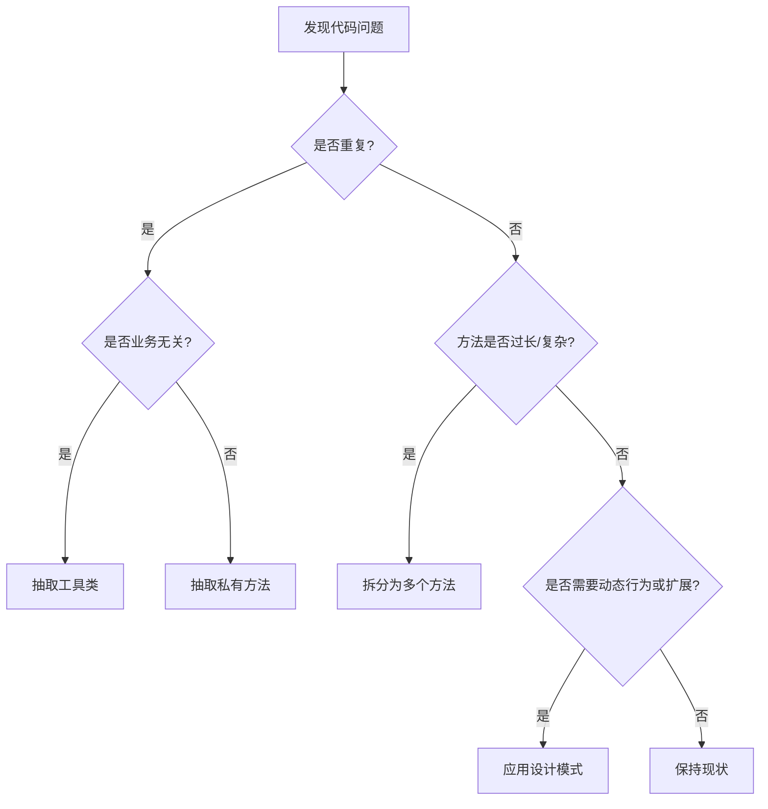

在Java Spring Boot项目中，合理抽取函数、工具类或设计模式是提升代码可维护性、复用性和可读性的关键。以下是具体的判断标准和实践建议：

---

### **一、何时抽取成函数（方法）？**
#### **适用场景**：
1. **重复代码片段**：相同逻辑在多个地方出现（超过2次）。
   ```java
   // 重复代码（坏味道）
   public void processOrderA(Order order) {
       if (order.getStatus() == Status.PAID && order.getItems().size() > 0) {
           // ...业务逻辑
       }
   }
   public void processOrderB(Order order) {
       if (order.getStatus() == Status.PAID && order.getItems().size() > 0) {
           // ...其他逻辑
       }
   }
   
   // 抽取为函数
   private boolean isOrderValid(Order order) {
       return order.getStatus() == Status.PAID && order.getItems().size() > 0;
   }
   ```

2. **复杂逻辑拆分**：一个方法过长（如超过20行）或嵌套过深。
   ```java
   // 原始长方法
   public void generateReport() {
       // 步骤1: 查询数据（可抽取）
       // 步骤2: 处理数据（可抽取）
       // 步骤3: 生成文件（可抽取）
   }
   ```

3. **明确意图**：通过方法名替代注释，提高可读性。
   ```java
   // 模糊逻辑
   if (user.getAge() > 18 && user.isVerified()) { ... }
   
   // 明确意图
   if (isEligibleForPremium(user)) { ... }
   ```

#### **原则**：
- **单一职责**：一个方法只做一件事。
- **无副作用**：尽量设计纯函数（输入决定输出，不修改外部状态）。

---

### **二、何时抽取成工具类（Utils/Helper）？**
#### **适用场景**：
1. **跨模块复用**：与业务无关的通用功能（如字符串处理、日期转换、加密等）。
   ```java
   // 工具类示例
   public final class StringUtils {
       public static String trimToEmpty(String str) {
           return str == null ? "" : str.trim();
       }
   }
   ```

2. **静态方法为主**：无需维护状态，仅提供工具方法。
   ```java
   // Spring的Assert工具类
   Assert.notNull(obj, "Object must not be null");
   ```

3. **避免重复造轮子**：优先使用现有工具库（如Apache Commons、Guava、Spring Utils）。

#### **原则**：
- **命名清晰**：如`DateUtils`、`HttpClientUtils`。
- **不可实例化**：工具类应为`final`+私有构造方法。
   ```java
   public final class MyUtils {
       private MyUtils() {
           throw new UnsupportedOperationException();
       }
   }
   ```

---

### **三、何时使用设计模式？**
#### **适用场景**：
1. **策略模式（Strategy）**：需要动态切换算法或行为。
   ```java
   // 支付方式切换
   public interface PaymentStrategy {
       void pay(BigDecimal amount);
   }
   @Service
   public class AlipayStrategy implements PaymentStrategy { ... }
   @Service
   public class WechatPayStrategy implements PaymentStrategy { ... }
   
   // 通过上下文调用
   public class PaymentContext {
       private PaymentStrategy strategy;
       public void setStrategy(PaymentStrategy strategy) { ... }
       public void executePayment(BigDecimal amount) {
           strategy.pay(amount);
       }
   }
   ```

2. **工厂模式（Factory）**：复杂对象的创建逻辑封装。
   ```java
   @Component
   public class NotificationFactory {
       public Notification create(String type) {
           switch (type) {
               case "SMS": return new SmsNotification();
               case "EMAIL": return new EmailNotification();
               default: throw new IllegalArgumentException();
           }
       }
   }
   ```

3. **装饰器模式（Decorator）**：动态扩展功能。
   ```java
   public abstract class CoffeeDecorator implements Coffee {
       protected Coffee decoratedCoffee;
       public CoffeeDecorator(Coffee coffee) {
           this.decoratedCoffee = coffee;
       }
   }
   ```

4. **观察者模式（Observer）**：事件驱动场景（如Spring的`ApplicationEvent`）。
   ```java
   @EventListener
   public void handleOrderEvent(OrderEvent event) { ... }
   ```

#### **原则**：
- **避免过度设计**：简单场景直接用if/else，不要为了模式而模式。
- **Spring整合**：优先利用Spring的依赖注入、事件机制等原生能力。

---

### **四、决策流程图**


---

### **五、Spring Boot中的最佳实践**
1. **工具类**：
   - 使用`org.springframework.util`下的`Assert`、`StringUtils`等。
   - 自定义工具类用`static`方法，避免注入Spring Bean。

2. **业务逻辑**：
   - 将核心业务抽取到`@Service`中，保持Controller轻薄。
   - 领域逻辑优先用领域模型（Domain Model）而非Utils。

3. **设计模式**：
   - 利用`@Autowired`实现策略模式。
   - 使用`@Bean`定义工厂方法。

---

### **示例对比**
#### **Bad Practice**
```java
// Controller中混杂业务逻辑
@PostMapping("/order")
public ResponseEntity<?> createOrder(@RequestBody OrderDto dto) {
    // 参数校验（应抽取）
    if (dto.getItems() == null || dto.getItems().isEmpty()) {
        throw new IllegalArgumentException("订单项不能为空");
    }
    // 价格计算（应抽取）
    BigDecimal total = BigDecimal.ZERO;
    for (Item item : dto.getItems()) {
        total = total.add(item.getPrice().multiply(item.getQuantity()));
    }
    // 保存订单（应委托给Service）
    Order order = new Order();
    order.setTotal(total);
    orderRepository.save(order);
    return ResponseEntity.ok().build();
}
```

#### **Good Practice**
```java
// 抽取校验逻辑到工具类
public class OrderValidator {
    public static void validate(OrderDto dto) {
        Assert.notEmpty(dto.getItems(), "订单项不能为空");
    }
}

// 抽取业务逻辑到Service
@Service
public class OrderService {
    public Order createOrder(OrderDto dto) {
        OrderValidator.validate(dto);
        BigDecimal total = calculateTotal(dto.getItems());
        return orderRepository.save(new Order(total));
    }
    private BigDecimal calculateTotal(List<Item> items) {
        return items.stream()
            .map(item -> item.getPrice().multiply(item.getQuantity()))
            .reduce(BigDecimal.ZERO, BigDecimal::add);
    }
}

// Controller保持简洁
@PostMapping("/order")
public ResponseEntity<Order> createOrder(@RequestBody OrderDto dto) {
    return ResponseEntity.ok(orderService.createOrder(dto));
}
```

---

通过合理拆分函数、工具类和设计模式，可以使代码更符合 **SOLID** 原则，尤其在Spring Boot的上下文中，充分利用IoC和AOP能力，能显著提升工程效率。
