# JVM学习笔记

## 问题：

* 运行的系统突然卡死，系统无法访问，甚至直接OOM
* 想解决线上JVM GC 问题，但看不懂日志
* 如何解决GC、OOM等问题

## 思考：

* 如何让系统更快
* 如何避免系统出现瓶颈

## JVM整体结构

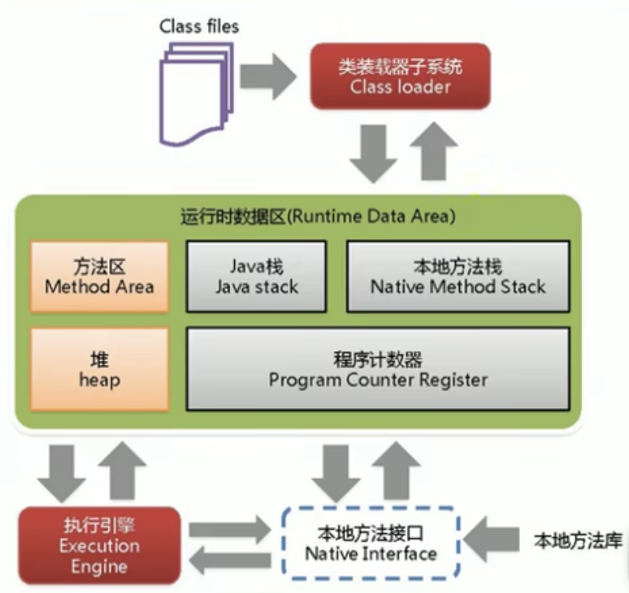

## java代码执行流程

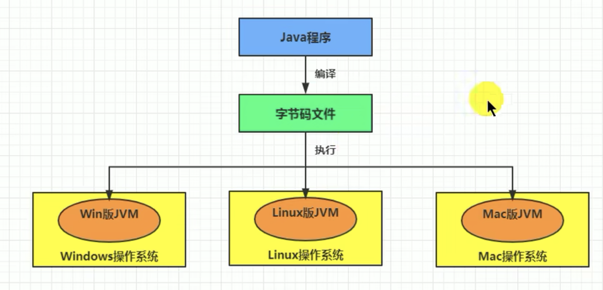

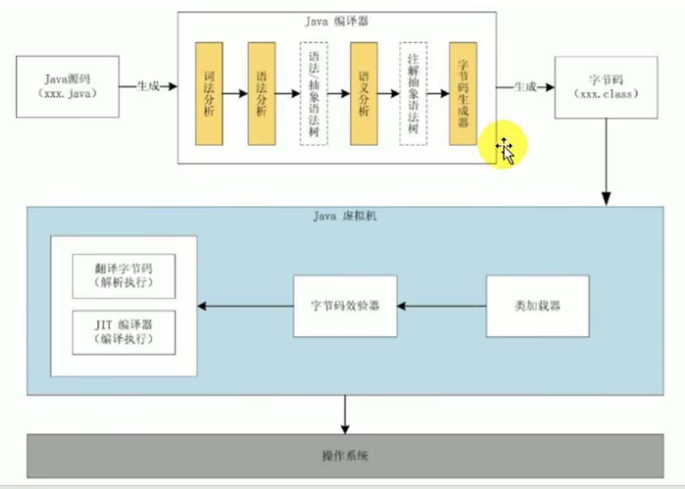

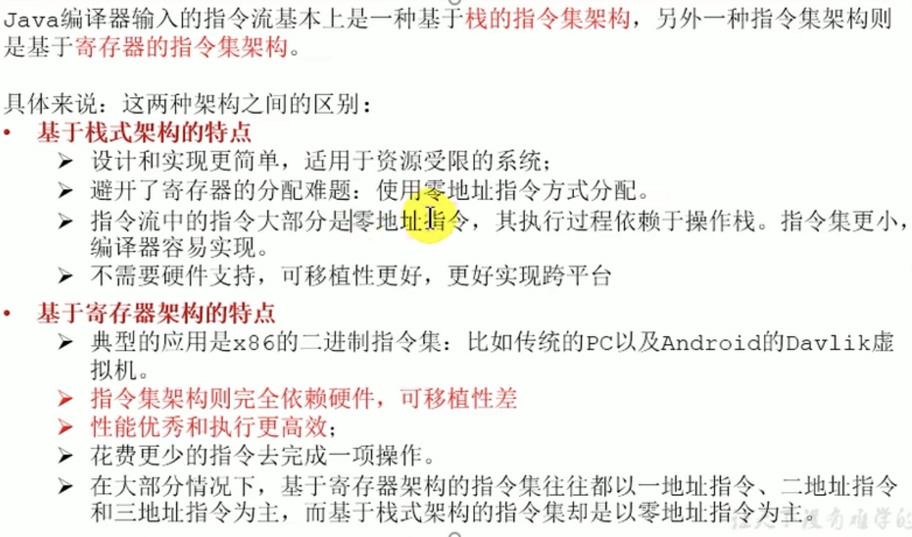

**反编译指令**：

``` bash
javap -v *.jar
```

总结：由于跨平台性的设计，Java的指令都是根据栈来设计的

栈：跨平台性、指令集小、指令多；执行性能比寄存器差

## JVM的生命周期

* 虚拟机的启动
  * 虚拟机启动是通过引导类加载器(bootstrap class loader)，创建初始类(initial class)来完成的，这个类有虚拟机的具体实现指定的
* 虚拟机的执行
  * 程序开始制定的时他才运行，程序结束他就停止
  * 执行java程序，实际是执行一个叫java虚拟机的进程
  * **jps命令** ：打印当前执行的进程
* 虚拟机的退出
  * 程序正常执行结束
  * 遇到异常货错误而异常终止
  * 由于操作系统错误导致java虚拟机进程终止
  * 线程调用Runtime类或System类的exit方法，或Runtime类的halt方法，并且Java安全管理器也允许这次exit或halt操作
  * 了解：JNI规范描述了用JNI Invocation API来加载或卸载Java虚拟机时，Java虚拟机的退出情况

## JVM的发展历程

* Sum Classic VM
  * 只提供了解释器
  * Hotspot内置了Sum Classic VM
  * 如需需要JIT则需要外挂，而且必须二选一无法协同工作
* Exact VM
  * 虚拟机可以知道内存中某个位置的数据具体是什么类型
  * 具备现代高性能虚拟机的雏形
    * 热点探测
    * 编译器与解释器混合工作模式
* Hotspot
  * 默认使用的，占据目前市场
  * 热点代码探测技术
    * 通过计数器找到最具变异价值的代码，触发时及时编译或栈上替换
    * 通过编译器与解释器协同工作，在最优化的程序响应时间与最佳执行性能中取得平衡
* JRockit
  * 专注于服务器端
  * JRockit JVM是时间上最快的JVM
* J9：IBM公司开发的

* KVM和CDC/CLDC Hotspot
* Azul VM
* Apache Harmony:IBM与Intel联合开发开源的

## 内存结构

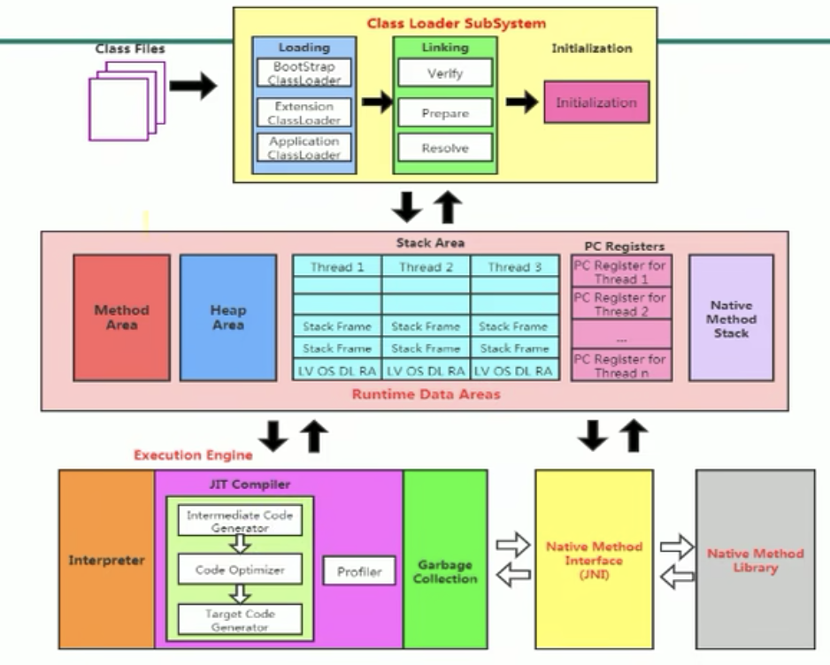

## 类加载器

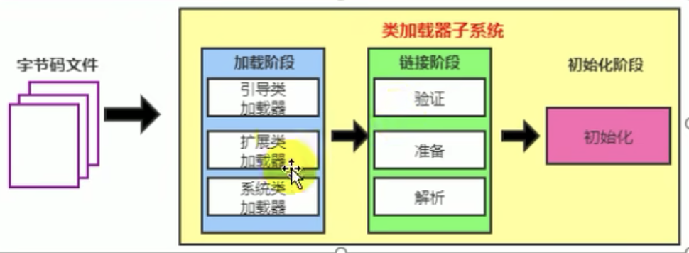

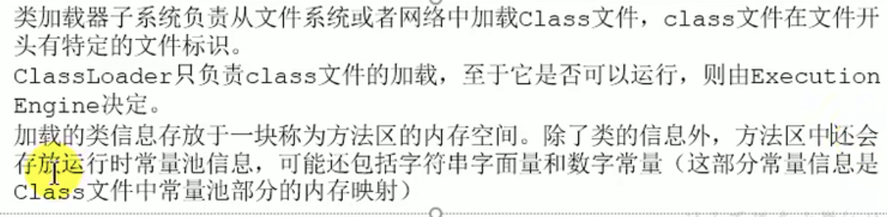

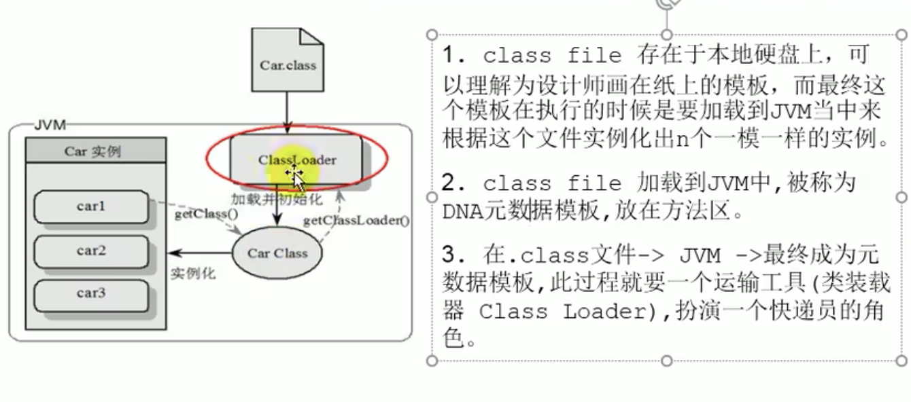

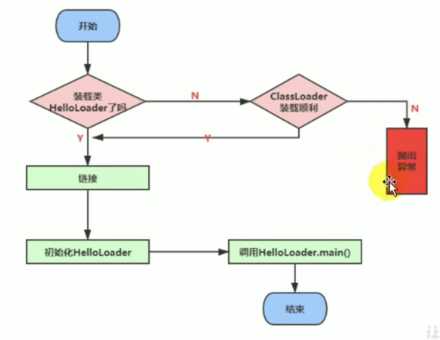

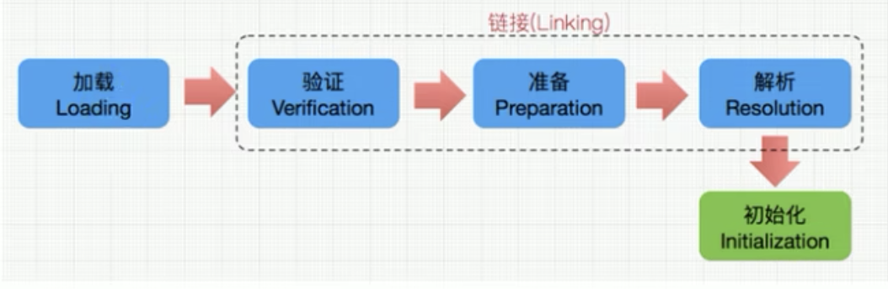

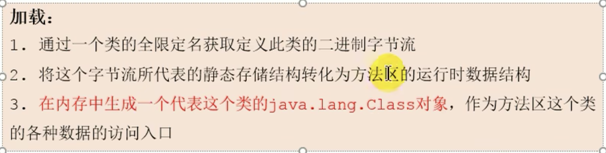

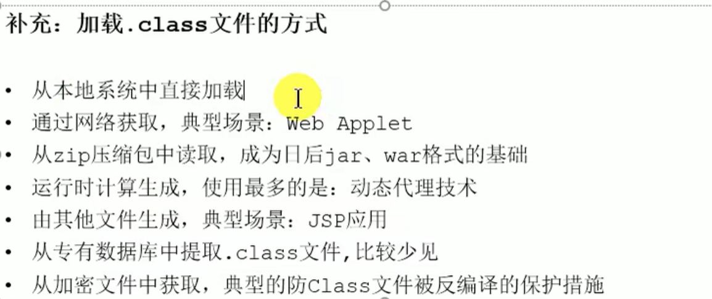

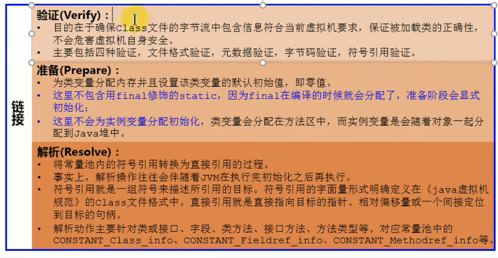

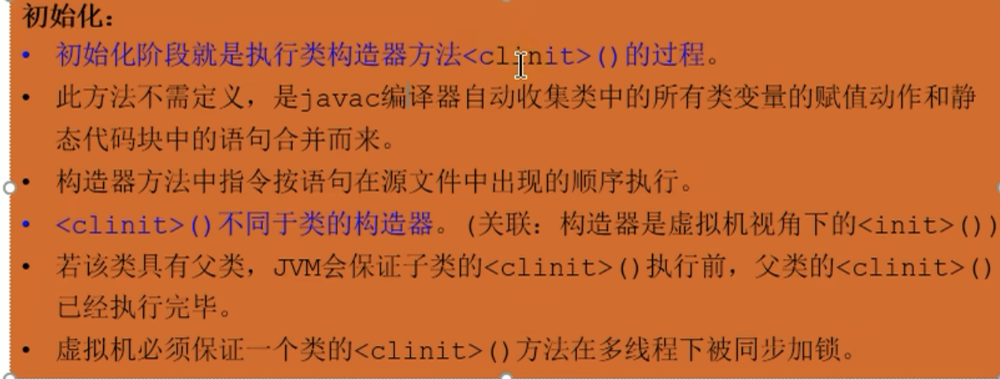

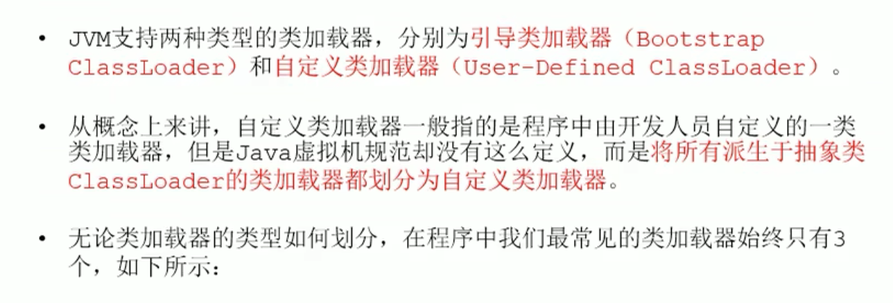


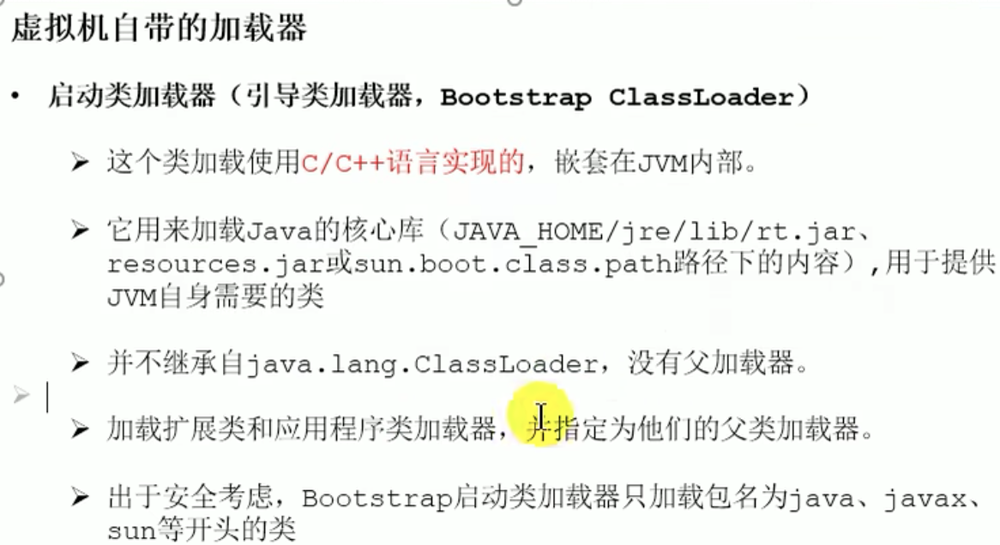

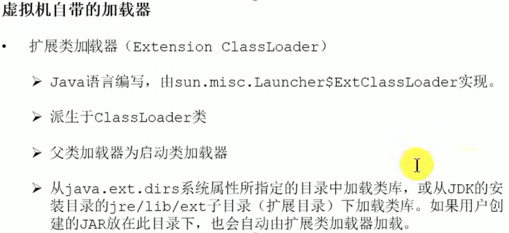


引导类加载器打印类加载器会为null

