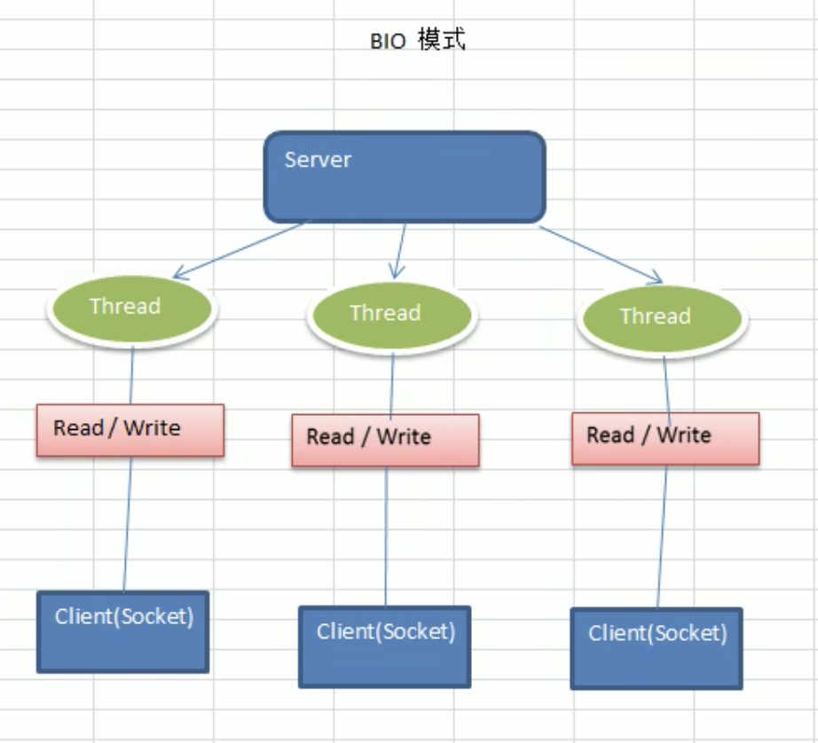

# Netty笔记

## Netty是什么

netty是一个异步的、基于事件驱动的网络应用框架，用以快速开发高性能、高可靠性的网络IO程序

主要针对在TCP协议下，面向Clients端端高并发应用，或者Peer to Peer场景下的大量数据持续传输的应用。

本质是一个NIO框架，适用于服务器通讯相关的多种应用场景

TCP/IP<-JDK原生<-NIO<-Netty

## Netty应用场景

* RPC框架
* 游戏行业
* 大数据领域

## IO模型

IO模型就是用什么样的通道进行数据的发送和接收，很大程度上决定了程序通信性能

Java支持3种网络编程模型 /IO模型:BIO、NIO、AIO

* BIO 同步并阻塞（传统阻塞型）

  一个连接一个线程，容易造成不必要的线程开销

  

* NIO 同步非阻塞

  一个线程处理多个请求（连接），客户端发送的请求都会注册到多路复用器上，多路复用器轮询到连接有I/O的请求就进行处理


* AIO 异步非阻塞，AIO引入了异步通道的概念，采用了Proactor模型，简化了程序编写，有效的请求才启动线程，它的特点是先由操作系统完成后才通知服务端程序启动线程去处理，一般适用于连接数较多且连接时间较长的应用。

#### BIO、NIO、AIO适用场景

* BIO 方式适用于**连接数目比较小且固定**的架构，这种方式对服务器资源要求比较高,并发局限于应用中，JDK1.4以前的唯一选择，但程序简单易理解。
* NIO 方式适用于**连接数目多且连接比较短**(轻操作)的架构，比如聊天服务器，弹幕系统，服务器间通讯等。编程比较复杂，JDK1.4开始支持:
* AIO 方式使用于**连接数目多且连接比较长**(重操作)的架构，比如相册服务器，充分调用OS参与并发操作，编程比较复杂，JDK7开始支持。

## BIO介绍

* Java BIO 就是传统的javaIO 编程，其相关的类和接口在 java.io
* BI0(blocking I/O): **同步阻塞**，服务器实现模式为一个连接一个线程，即客户端有连接请求时服务器端就需要启动一个线程进行处理，如果这个连接不做任何事情会造成不必要的线程开销，可以通过**线程池机制改善**。
* BIO方式适用于连接数目比较小且固定的架构，这种方式对服务器资源要求比较高3)并发局限于应用中，JDK1.4以前的唯一选择，程序简单易理解

## BIO实例及分析

Coming soon...

## BIO内容梳理小结

Coming soon...

## NIO介绍

* Java NIO 全称 java non-blocking lO，是指 JDK提供的新API。从 JDK1.4 开始，Java 提供了一系列改进的输入/输出的新特性，被统称为 NIO(即 New lO)，是**同步非阻塞**的
* NIO 相关类都被放在 java.nio 包及子包下，并且对原 java.io包中的很多类进行改写。
* NIO 有三大核心部分:**Channel(通道)，Buffer(缓冲区),Selector(选择器)**
* NIO是 面向**缓冲区，或者面向块**编程的。数据读取到一个它稍后处理的缓冲区，需要时可在缓冲区中前后移动，这就增加了处理过程中的灵活性，使用它可以提供非阻塞式的高伸缩性网络
* Java NIO的非阻塞模式，使一个线程从某通道发送请求或者读取数据，但是它仅能得到目前可用的数据，如果目前没有数据可用时，就什么都不会获取，而**不是保持线程阻塞**，所以直至数据变的可以读取之前，该线程可以继续做其他的事情。非阻塞写也是如此，一个线程请求写入一些数据到某通道，但不需要等待它完全写入，这个线程同时可以去做别的事情。
* 通俗理解:NIO是可以做到用一个线程来处理多个操作的。假设有10000个请求过来根据实际情况，可以分配50或者100个线程来处理。不像之前的阻塞10那样，非得分配10000个。
* HTTP2.0使用了多路复用的技术，做到同一个连接并发处理多个请求，而且并发请求的数量比HTTP1.1大了好几个数量级。

## NIO的Buffer基本使用

基本方法

* allocate() 设置大小，含义为可以方多少个
* capacity() 容量有多大
* **flip() 读写切换**
* hasRemaining()有过有剩余就返回true
* get() 没get一次索引就会往后移动一次

**NIO和BIO的比较**

* BIO以流的方式处理数据,而 NIO以块的方式处理数据,块 I/O的效率比流 I/O高很多
* BIO是阻塞的，NIO 则是非阻塞的
* BIO基于字节流和字符流进行操作，而 NIO基于 Channel(通道)和 Buffer(缓冲区)进行操作，数据总是从通道读取到缓冲区中，或者从缓冲区写入到通道中。Selector(选择器)用于监听多个通道的事件(比如:连接请求，数据到达等)，因此使用**单个线程就可以监听多个客户端通道**

## NIO三大核心组件的关系

关系说明

* 每个channel都会对应一个Bufer
* Selector对应一个线程，一个线程对应多个channel(连接)
* 程序切换到那个channel是由事件决定的，Event就是一个重要的概念
* Selector会根据不同的事件，在各个通道上切换
* Buffer就是一个内存块，底层是有一个数组
* 数据的读取写入是通过Buffer，BIO中要么是输入流，要么是输出流，不能是双向的，但是NIO的Buffer是可以读也可以写，需要flip方法读写切换
* channel是双向的，可以返回底层操作系统的情况

## Buffer的机制及子类

缓冲区(Buffer):缓冲区本质上是一个可以读写数据的内存块，可以理解成是一个**容器对象(含数组)**，该对象提供了**一组方法**，可以更轻松地使用内存块，，缓冲区对象内置了一些机制，能够跟踪和记录缓冲区的状态变化情况。Channel 提供从文件、网络读取数据的渠道，但是读取或写入的数据都必须经由Buffer

### **NIO中Buffer下面的子类**

* ByteBuffer，存储字节数据到缓冲区
* ShortBuffer，存储字符串数据到缓冲区
* CharBuffer，存储字符数据到缓冲区
* IntBuffer，存储整数数据到缓冲区
* LongBuffer，存储长整型数据到缓冲区
* DoubleBuffer，存储小数到缓冲区
* FloatBuffer，存储小数到缓冲区

### Buffer类型定义了缓冲区都具有的四个属性

| 属性     | 描述                                                         |
| -------- | ------------------------------------------------------------ |
| Capacity | 容量，即可以容纳的最大数据量;在缓冲区创建时被设定并且不能改变 |
| Limit    | 表示缓冲区的当前终点，不能对缓冲区超过极限的位置进行读写操作。且极限是可以修改的 |
| Position | 位置，下一个要被读或写的元素的索引，每次读写缓冲区数据时都会改变改值，为下次读写作准备 |
| Mark     | 标记                                                         |


``` java
public final Buffer flip(){
  limit = position;
  position = 0;
  mark = -1;
  return this;
}
```

### Buffer的相关方法
//JDK1.4时引入的api

**public final int capacity()//返回此缓冲区的容量**

**public finalint position()//返回此缓冲区的位置**

**public final Buffer position (int newPositio)//设置此缓冲区的位置**

**public final int limit()//返回此缓冲区的限制**

**public final Buffer limit (int newLimit)//设置此缓冲区的限制**

public final Buffer mark()//在此缓冲区的位置设置标记,

public final Buffer reset()//将此缓冲区的位置重置为以前标记的位置

**public final Buffer clear()//清除此缓冲区,即将各个标记恢复到初始状态，但是数据并没有真正擦除**

**public final Buffer flip()//反转此缓冲区**
public final Bufferrewind()//重绕此缓冲X
public finalint remaining()//返回当前位置与限制之间的元素数

**public final boolean hasRemaining()//告知在当前位置和限制之间是否有元素**

**public abstract boolean isReadOnly();//告知此缓冲区是否为只读缓冲区**
//JDK1.6时引入的api
**public abstract boolean hasArray();//告知此缓冲区是否具有可访问的底层实现数组**

**public abstract Object array();//返回此缓冲区的底层实现数组**

public abstractint arrayOffset0);//返回此缓冲区的底层实现数组中第一个缓冲区元素的偏移量public abstract boolean isDirect();//告知此缓冲区是否为直接缓冲区

### ByteBuffer

//缓冲区创建相关api

**public static ByteBuffer allocateDirect(int capacity)//创建直接缓神X**

**public static ByteBuffer allocate(int capacity)//设置缓冲区的初始容量**

public static ByteBuffer wrap(bytell array)//把一个数组放到缓冲区中使用//构造初始化位置offset和上界length的缓冲区

public static ByteBuffer wrap(bytel] array,int offset, int length)//缓存区存取相关API
**public abstract byte get();//从当前位置position上get，get之后，position会自动+1**

**public abstract byte get (int index);//从绝对位置get**

**public abstract ByteBuffer put (byte b);//从当前位置上添加，put之后，position会自动+1**

**public abstract ByteBuffer put (int index, byte b);//从绝对位置-put**

## Channel的基本介绍

### NIO的通道类似于流，但有些区别如下:

* 通道可以同时进行读写，而流只能读或者只能写

* 通道可以实现异步读写数据

* 通道可以从缓冲读数据，也可以写数据到缓冲:

### Channel的介绍

1. BIO中的 stream 是单向的，例如 FilelnputStream 对象只能进行读取数据的操作，而 NIO 中的通道(Channel)是双向的，可以读操作，也可以写操作。

2. Channel在NIO中是一个接口**public interface Channel extends Closeable{}**

3. 常用的 Channel 类有:**FileChannel、DatagramChannel、ServerSocketChannel 和SocketChannel.**

4. FileChannel 用于文件的数据读写,DatagramChannel 用于 UDP 的数据读写,ServerSocketChannel和SocketChannel用于TCP的数据读写。


### Filechannel类
FileChannel主要用来对本地文件进行I/O 操作，常见的方法有

* public int read(ByteBuffer dst)，从通道读取数据并放到缓冲区中
* public int write(ByteBuffer src)，把缓冲区的数据写到通道中
* public long transferFrom(ReadableByteChannel src,long position, long count)，从目标通道中复制数据到当前通道
* public long transferTo(long position, long count, WritableByteChannel target)，把数据从当前通道复制给目标通道

Comining soon...

